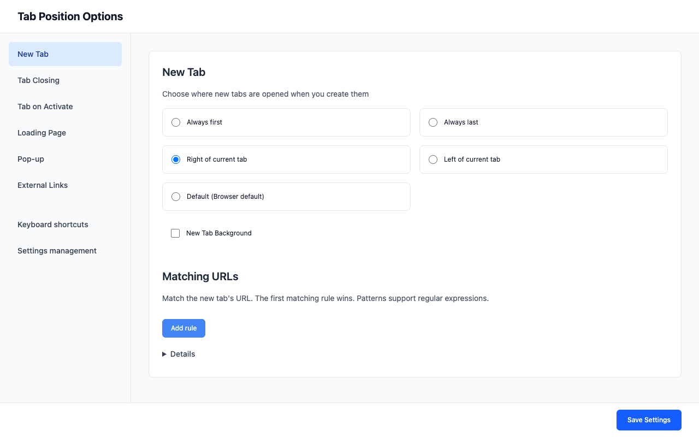

<div align="center">
  

# Tab Position Options Fork

[English](README.md) | [日本語](README.ja.md) | [简体中文](README.zh-CN.md)

[](https://chromewebstore.google.com/detail/tab-position-options-fork/bimiahgcjenkoacmdfggckkaflnnebki)
[](https://chromewebstore.google.com/detail/tab-position-options-fork/bimiahgcjenkoacmdfggckkaflnnebki)
[](https://chromewebstore.google.com/detail/tab-position-options-fork/bimiahgcjenkoacmdfggckkaflnnebki)
[](https://github.com/proshunsuke/tab-position-options-fork)
[](https://developer.chrome.com/docs/extensions/mv3/)
[](https://github.com/proshunsuke/tab-position-options-fork)

<a href="https://chromewebstore.google.com/detail/tab-position-options-fork/bimiahgcjenkoacmdfggckkaflnnebki">
  
</a>

</div>

新しいタブを開く位置、バックグラウンドで開くかどうか、現在のタブを閉じた後にアクティブにするタブを設定できるChrome拡張機能です。原版のTab Position OptionsをManifest V3向けに再実装しています。

## 使い始める

1. Chrome Web Storeから拡張機能をインストールします。
2. Chromeの拡張機能メニューまたはツールバーのアイコンから開きます。
3. 設定を選び、**設定を保存（Save Settings）**をクリックします。

設定画面はブラウザの表示言語に合わせて表示されます。[対応言語](locales/)以外では英語を使用します。

ソースコードからインストールする場合は、[手動インストール](#手動インストール)を参照してください。



## プライバシー

設定と入力した URL ルールは、Chrome の同期が有効な場合に自動同期され、端末内にも保持されます。閲覧情報やセッション中のタブ情報は端末内でのみ扱います。

詳細は[プライバシーポリシー](PRIVACY.md)を参照してください。

## 開発

WXT・TypeScript・React・Tailwind CSSを使用し、コードチェックにはBiome、E2EテストにはPlaywrightを使用しています。

### 環境構築

[CIワークフロー](.github/workflows/test.yml)のバージョンに合わせたNode.jsとnpmを使用してください。

```fish
git clone https://github.com/proshunsuke/tab-position-options-fork.git
cd tab-position-options-fork
npm ci
npx wxt prepare
```

### 主なコマンド

```fish
npm run dev          # ホットリロード対応のChrome開発モードを起動
npm run build        # Chrome拡張機能をビルド
npm run typecheck    # TypeScriptの型チェック
npm run lint:check   # ファイルを変更せずlintとフォーマットを確認
```

全スクリプトは[package.json](package.json)を参照してください。`npm run lint`はunsafeな修正を含む自動修正を適用します。

### 手動インストール

上記の環境構築を完了してから、以下を実施します。

1. `npm run build`を実行します。
2. Chromeで`chrome://extensions`を開き、**Developer mode**を有効にします。
3. **Load unpacked**をクリックし、`dist/chrome-mv3`ディレクトリを選択します。
4. 拡張機能を開き、設定を選んで**設定を保存（Save Settings）**をクリックします。

再ビルド後は、`chrome://extensions`から拡張機能を再読み込みして更新を反映してください。

### 単体テスト

```fish
npm run test:unit
```

### E2Eテスト

初回実行前にPlaywrightのChromiumをインストールします。

```fish
npx playwright install chromium
npm run test:e2e:sharded
```

`test:e2e:sharded`は1回のビルド後にヘッドレスChromiumで3分割を並列実行し、レポートを統合します。順次実行する場合は`test:e2e`を使用してください。ディスプレイのないLinux環境で`test:e2e`を使う場合は、[CIワークフロー](.github/workflows/test.yml)のXvfb設定を使用してください。環境構築とテスト固有の手順は[E2Eガイド](.agents/skills/tab-position-e2e/SKILL.md)を参照してください。

## リリース

手動で起動するリリースワークフローがChrome Web Storeへドラフトをアップロードし、その後、拡張機能のZIPを添付したGitHub Releaseを作成します。ストアの審査提出は別途手動で行います。

準備と公開の手順は[リリースガイド](.agents/skills/tab-position-release/SKILL.md)、リリースノートは[CHANGELOG.md](CHANGELOG.md)を参照してください。

ストア申請情報は[CHROMEWEBSTORE.md](CHROMEWEBSTORE.md)で管理します。先にリポジトリ内の文書を更新・確認し、その内容をDeveloper Dashboardに反映します。

## 謝辞

原版の[Tab Position Options](https://chrome.google.com/webstore/detail/tab-position-options/fjccjnfkdkdmjohojoggodkigkjkkjhl)の開発者に感謝します。本プロジェクトは独立したフォークであり、Googleとは関係ありません。

## 貢献

[不具合報告・機能提案](https://github.com/proshunsuke/tab-position-options-fork/issues)や[プルリクエスト](https://github.com/proshunsuke/tab-position-options-fork/pulls)を歓迎します。

## ライセンス

[MIT](LICENSE.txt)
