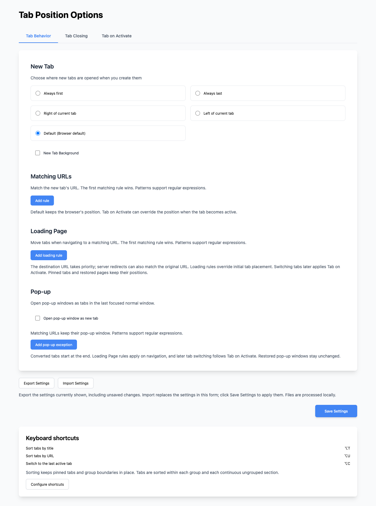

<div align="center">
  

# Tab Position Options Fork

[English](README.md) | [日本語](README.ja.md) | [简体中文](README.zh-CN.md)

[](https://chromewebstore.google.com/detail/tab-position-options-fork/bimiahgcjenkoacmdfggckkaflnnebki)
[](https://chromewebstore.google.com/detail/tab-position-options-fork/bimiahgcjenkoacmdfggckkaflnnebki)
[](https://chromewebstore.google.com/detail/tab-position-options-fork/bimiahgcjenkoacmdfggckkaflnnebki)
[](https://github.com/proshunsuke/tab-position-options-fork)
[](https://developer.chrome.com/docs/extensions/mv3/)
[](https://github.com/proshunsuke/tab-position-options-fork)

<a href="https://chromewebstore.google.com/detail/tab-position-options-fork/bimiahgcjenkoacmdfggckkaflnnebki">
  
</a>

</div>

A Chrome extension that lets you customize where new tabs open, whether they open in the background, and which tab becomes active after closing the current tab. Reimplemented from the original Tab Position Options for Manifest V3.

## Getting Started

1. Install the extension from the Chrome Web Store.
2. Open the extension from Chrome's Extensions menu or its toolbar icon.
3. Choose your preferences and click **Save Settings**.

The options page follows your browser’s UI language. See [supported languages](locales/); unsupported languages fall back to English.

For installation from source, see [Manual Installation](#manual-installation).



## Privacy

Settings are stored locally on your device. The extension does not send data to external servers.

See the [Privacy Policy](PRIVACY.md) for details.

## Development

Built with WXT, TypeScript, React, and Tailwind CSS, with Biome for code checks and Playwright for E2E tests.

### Setup

Use Node.js and npm matching the version in the [CI workflow](.github/workflows/test.yml).

```fish
git clone https://github.com/proshunsuke/tab-position-options-fork.git
cd tab-position-options-fork
npm ci
npx wxt prepare
```

### Common Commands

```fish
npm run dev          # Start Chrome development mode with hot reload
npm run build        # Build the Chrome extension
npm run typecheck    # Check TypeScript types
npm run lint:check   # Check lint and formatting without modifying files
```

See [package.json](package.json) for all scripts. `npm run lint` applies automatic fixes, including unsafe fixes.

### Manual Installation

After completing the setup above:

1. Run `npm run build`.
2. Open `chrome://extensions` in Chrome and enable **Developer mode**.
3. Click **Load unpacked** and select the `dist/chrome-mv3` directory.
4. Open the extension, choose your preferences, and click **Save Settings**.

After rebuilding, reload the extension from `chrome://extensions` to use the updated build.

### Unit Tests

```fish
npm run test:unit
```

### E2E Tests

Install Playwright's Chromium before the first run:

```fish
npx playwright install chromium
npm run test:e2e:sharded
```

`test:e2e:sharded` builds once, runs three headless Chromium shards in parallel, and merges their reports. Use `test:e2e` for sequential execution. For `test:e2e` on Linux without a display, use the Xvfb setup in the [CI workflow](.github/workflows/test.yml). See the [E2E guide](.agents/skills/tab-position-e2e/SKILL.md) for environment setup and test-specific procedures.

## Releases

The manually triggered release workflow uploads a draft to the Chrome Web Store, then creates a GitHub Release with the extension ZIP. Submission for store review is a separate manual step.

See the [release guide](.agents/skills/tab-position-release/SKILL.md) for preparation and publishing procedures, and [CHANGELOG.md](CHANGELOG.md) for release notes.

Store submission information is maintained in [CHROMEWEBSTORE.md](CHROMEWEBSTORE.md). Update and verify the repository documents first, then apply them to the Developer Dashboard.

## Acknowledgments

Thanks to the developer of the original [Tab Position Options](https://chrome.google.com/webstore/detail/tab-position-options/fjccjnfkdkdmjohojoggodkigkjkkjhl). This project is an independent fork and is not affiliated with Google.

## Contributing

[Bug reports and feature requests](https://github.com/proshunsuke/tab-position-options-fork/issues) and [pull requests](https://github.com/proshunsuke/tab-position-options-fork/pulls) are welcome.

## License

[MIT](LICENSE.txt)
