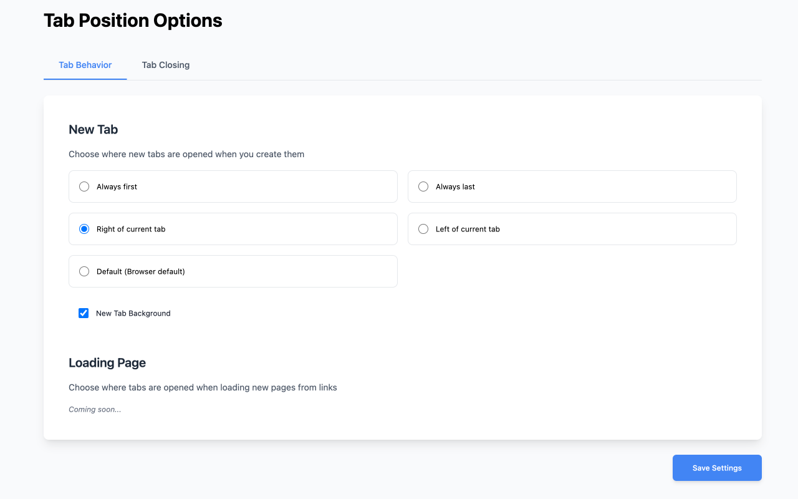

<div align="center">
  
  
  # Tab Position Options
  
  ### Take control of your Chrome tabs like never before 🎯
  
  [](https://chrome.google.com/webstore/detail/tab-position-options/bimiahgcjenkoacmdfggckkaflnnebki)
  [](https://chrome.google.com/webstore/detail/tab-position-options/bimiahgcjenkoacmdfggckkaflnnebki)
  [](https://chrome.google.com/webstore/detail/tab-position-options/bimiahgcjenkoacmdfggckkaflnnebki)
  [](https://github.com/proshunsuke/tab-position-options-fork)
  [](https://developer.chrome.com/docs/extensions/mv3/)
  [](https://github.com/proshunsuke/tab-position-options-fork)
  
  <a href="https://chrome.google.com/webstore/detail/tab-position-options/bimiahgcjenkoacmdfggckkaflnnebki">
    
  </a>
</div>

---

## ✨ Features at a Glance

<div align="center">
  <table>
    <tr>
      <td align="center" width="33%">
        <h3>🎯 New Tab Position</h3>
        <p>Control exactly where your new tabs appear - first, last, or relative to current tab</p>
      </td>
      <td align="center" width="33%">
        <h3>📌 Smart Tab Closing</h3>
        <p>Choose which tab becomes active when you close a tab - no more jumping around!</p>
      </td>
      <td align="center" width="33%">
        <h3>🚀 Lightning Fast</h3>
        <p>Zero performance impact - built with Manifest V3 for maximum efficiency</p>
      </td>
    </tr>
  </table>
</div>

## 📸 Screenshot

<div align="center">
  
</div>

## 🚀 Getting Started

### Install from Chrome Web Store (Recommended)

1. Visit the [Chrome Web Store page](https://chrome.google.com/webstore/detail/tab-position-options/bimiahgcjenkoacmdfggckkaflnnebki)
2. Click "Add to Chrome"
3. Click the extension icon in your toolbar
4. Configure your preferences
5. Enjoy organized tabs! 🎉

### Manual Installation (For Developers)

See the [For Developers](#-for-developers) section below for detailed setup instructions.

## 🎨 How It Works

### New Tab Position Options

Choose where new tabs open when you press Ctrl/Cmd+T or click the + button:

- **🔵 Always First** - New tabs appear at the beginning
- **🔴 Always Last** - New tabs appear at the end
- **➡️ Right of Current** - New tabs open to the right of your active tab
- **⬅️ Left of Current** - New tabs open to the left of your active tab
- **⚪ Default** - Use Chrome's default behavior

### Tab Closing Behavior

Control which tab becomes active after closing a tab:

- **⏮️ First Tab** - Jump to the first tab
- **⏭️ Last Tab** - Jump to the last tab
- **▶️ Right Tab** - Activate the tab on the right
- **◀️ Left Tab** - Activate the tab on the left
- **🔄 In Activated Order** - Return to previously active tab
- **⚪ Default** - Use Chrome's default behavior

## 📊 Current Status

This is an early release focusing on core functionality. Some features from the original extension are still being implemented.

### ✅ Implemented
- **New Tab Position** - Full control over where new tabs open
- **Tab Closing Behavior** - Smart tab activation after closing

### 🚧 Coming Soon
- **Loading Page** - Control where tabs open from links
- **Tab on Activate** - Advanced tab activation features
- **Pop-up Windows** - Convert pop-ups to tabs

## 🛡️ Privacy & Security

<div align="center">
  <table>
    <tr>
      <td align="center">
        <h3>🔒 No Data Collection</h3>
        <p>All settings stored locally<br>Zero external connections</p>
      </td>
      <td align="center">
        <h3>✅ Manifest V3</h3>
        <p>Built with latest Chrome<br>security standards</p>
      </td>
      <td align="center">
        <h3>📖 Open Source</h3>
        <p>Fully transparent<br>Community driven</p>
      </td>
    </tr>
  </table>
</div>

## 📜 About This Fork

This is a modern fork of the original [Tab Position Options](https://chrome.google.com/webstore/detail/tab-position-options/fjccjnfkdkdmjohojoggodkigkjkkjhl) extension, updated for Chrome Manifest V3 to ensure continued compatibility and enhanced security.

We're grateful to the original developer for creating this useful extension. This fork aims to preserve its functionality while meeting modern Chrome security requirements.

## 🤝 Contributing

We welcome contributions! Feel free to:

- 🐛 [Report bugs](https://github.com/proshunsuke/tab-position-options-fork/issues)
- 💡 [Suggest features](https://github.com/proshunsuke/tab-position-options-fork/issues)
- 🔧 [Submit pull requests](https://github.com/proshunsuke/tab-position-options-fork/pulls)

## 🧑‍💻 For Developers

### Tech Stack

- **Framework**: [WXT](https://wxt.dev/) - Next generation web extension framework
- **Language**: TypeScript
- **UI**: React
- **Styling**: Tailwind CSS
- **Testing**: Playwright
- **Code Quality**: Biome

### Development Setup

1. **Clone & Install**
   ```bash
   git clone https://github.com/proshunsuke/tab-position-options-fork.git
   cd tab-position-options-fork
   npm install
   ```

2. **Development Commands**
   ```bash
   npm run dev          # Start dev server with HMR (Chrome)
   npm run dev:firefox  # Start dev server (Firefox)
   npm run build        # Production build (Chrome)
   npm run build:firefox # Production build (Firefox)
   npm run typecheck    # TypeScript type checking
   npm run lint         # Lint & format with Biome
   npm run test:e2e     # Run E2E tests with Playwright
   ```

### Release Process

Automated releases via GitHub Actions:
1. Update version in `package.json`
2. Commit and push changes
3. Run release workflow from [Actions tab](https://github.com/proshunsuke/tab-position-options-fork/actions/workflows/release.yml)
   - Creates GitHub release with ZIP file
   - Uploads to Chrome Web Store as draft

## 📄 License

This project is licensed under the MIT License.

---

<div align="center">
  Made with ❤️ for the Chrome community
  
  <sub>Not affiliated with Google Chrome</sub>
</div>