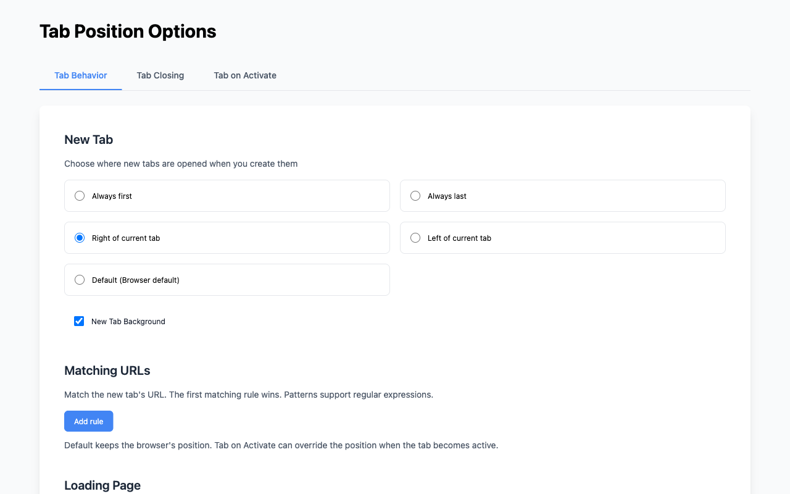

<div align="center">
  

# Tab Position Options Fork

[English](README.md) | [日本語](README.ja.md) | [简体中文](README.zh-CN.md)

[](https://chromewebstore.google.com/detail/tab-position-options-fork/bimiahgcjenkoacmdfggckkaflnnebki)
[](https://chromewebstore.google.com/detail/tab-position-options-fork/bimiahgcjenkoacmdfggckkaflnnebki)
[](https://chromewebstore.google.com/detail/tab-position-options-fork/bimiahgcjenkoacmdfggckkaflnnebki)
[](https://github.com/proshunsuke/tab-position-options-fork)
[](https://developer.chrome.com/docs/extensions/mv3/)
[](https://github.com/proshunsuke/tab-position-options-fork)

<a href="https://chromewebstore.google.com/detail/tab-position-options-fork/bimiahgcjenkoacmdfggckkaflnnebki">
  
</a>

</div>

这是一款Chrome扩展，可设置新标签页的打开位置、是否在后台打开，以及关闭当前标签页后激活哪个标签页。项目基于原版Tab Position Options，针对Manifest V3重新实现。



## 开始使用

1. 从Chrome Web Store安装扩展。
2. 通过Chrome的扩展菜单或工具栏图标打开扩展。
3. 选择所需设置，然后点击**Save Settings**。

如需从源代码安装，请参阅[手动安装](#手动安装)。

## 隐私

设置保存在您的设备本地。扩展不会向外部服务器发送数据。

## 开发

使用WXT、TypeScript、React和Tailwind CSS构建，使用Biome进行代码检查，使用Playwright进行E2E测试。

### 环境配置

请使用与[CI工作流](.github/workflows/test.yml)中版本一致的Node.js和npm。

```fish
git clone https://github.com/proshunsuke/tab-position-options-fork.git
cd tab-position-options-fork
npm ci
npx wxt prepare
```

### 常用命令

```fish
npm run dev          # 启动支持热重载的Chrome开发模式
npm run build        # 构建Chrome扩展
npm run typecheck    # 检查TypeScript类型
npm run lint:check   # 检查代码和格式，不修改文件
```

全部脚本请参阅[package.json](package.json)。`npm run lint`会自动修复问题，包括标记为unsafe的修复。

### 手动安装

完成上述环境配置后：

1. 运行`npm run build`。
2. 在Chrome中打开`chrome://extensions`，启用**Developer mode**。
3. 点击**Load unpacked**，选择`dist/chrome-mv3`目录。
4. 打开扩展，选择所需设置，然后点击**Save Settings**。

重新构建后，请在`chrome://extensions`中重新加载扩展以应用更新。

### 单元测试

```fish
npm run test:unit
```

### E2E测试

首次运行前，请安装Playwright的Chromium：

```fish
npx playwright install chromium
npm run test:e2e:sharded
```

`test:e2e:sharded`只构建一次，然后使用无头Chromium并行运行三个分片并合并报告。如需顺序执行，请使用`test:e2e`。在没有显示环境的Linux系统上运行`test:e2e`时，请使用[CI工作流](.github/workflows/test.yml)中的Xvfb配置。环境配置和测试专用步骤请参阅[E2E指南](.agents/skills/tab-position-e2e/SKILL.md)。

## 发布

手动触发的发布工作流会先向Chrome Web Store上传草稿，再创建附带扩展ZIP文件的GitHub Release。提交商店审核需要另行手动操作。

准备和发布步骤请参阅[发布指南](.agents/skills/tab-position-release/SKILL.md)，版本说明请参阅[CHANGELOG.md](CHANGELOG.md)。

商店提交信息在[CHROMEWEBSTORE.md](CHROMEWEBSTORE.md)中维护。先更新并核对仓库中的文档，再将内容同步到Developer Dashboard。

## 致谢

感谢原版[Tab Position Options](https://chrome.google.com/webstore/detail/tab-position-options/fjccjnfkdkdmjohojoggodkigkjkkjhl)的开发者。本项目是独立的分支项目，与Google无关联。

## 参与贡献

欢迎提交[问题报告和功能建议](https://github.com/proshunsuke/tab-position-options-fork/issues)以及[Pull Request](https://github.com/proshunsuke/tab-position-options-fork/pulls)。

## 许可证

[MIT](LICENSE.txt)
